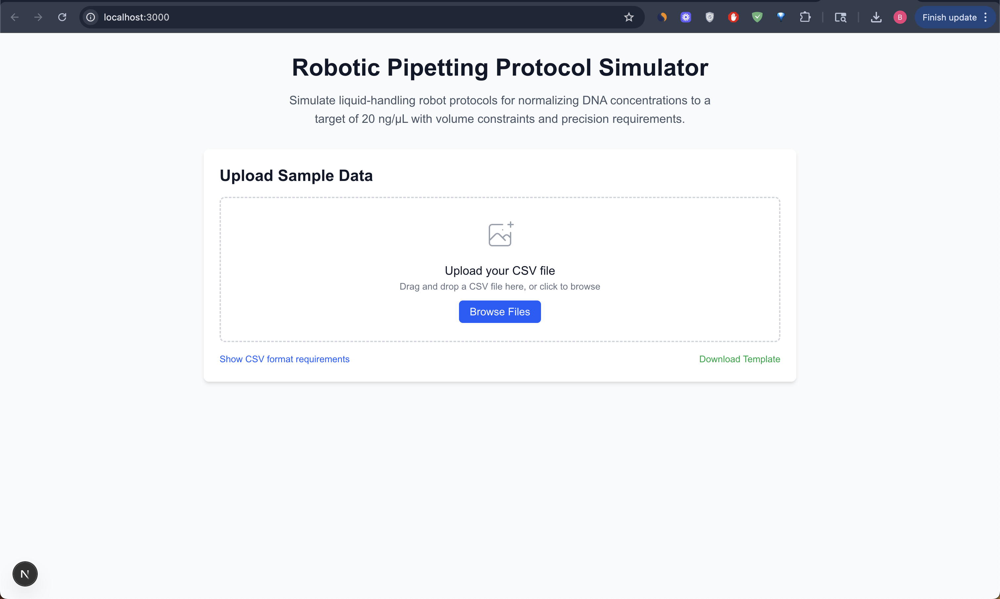

# Robotic Pipetting Protocol Simulator

A Next.js web application that simulates liquid-handling robot protocols for normalizing DNA concentrations to a target of 20 ng/µL with volume constraints and precision requirements.

## Features

- **CSV File Upload**: Drag and drop or browse to upload sample concentration data
- **Real-time Simulation**: Calculate pipette volumes using the dilution formula C1×V1 = C2×V2
- **Volume Constraints**: Respects maximum total volume (50 µL) and minimum pipettable volumes
- **Precision Rounding**: Rounds volumes to 0.1 µL precision for robotic automation
- **Interactive Results**: Sortable table with sample volumes, water volumes, and final concentrations
- **Data Visualization**: Charts showing volume distributions and concentration analysis
- **CSV Export**: Download results in automation-ready format
- **Comprehensive Testing**: Full test suite with edge case coverage

## Technical Stack

- **Frontend**: Next.js 15, React 19, TypeScript
- **Styling**: Tailwind CSS
- **Charts**: Recharts
- **CSV Parsing**: PapaParse
- **Testing**: Jest, React Testing Library
- **Build Tool**: Next.js App Router

## Installation

1. Clone the repository:
```bash
git clone https://github.com/bmwoolf/Simulate_Pipette_Robot.git
cd Simulate_Pipette_Robot
```

2. Install dependencies:
```bash
npm install
```

3. Start the development server:
```bash
npm run dev
```

4. Open [http://localhost:3000](http://localhost:3000) in your browser.



## Usage

### 1. Prepare Your Data
Create a CSV file with the following format:
```csv
SampleID,Concentration (ng/µL)
Sample01,48.7
Sample02,12.3
Sample03,35.2
...
```

### 2. Upload and Simulate
- Drag and drop your CSV file or click "Browse Files"
- The application will automatically process your data
- View results in the interactive table
- Analyze volume distributions with the charts

### 3. Export Results
- Click "Download CSV" to get automation-ready output
- The exported file contains: SampleID, Volume Sample (µL), Volume Water (µL)

## Algorithm Details

### Dilution Formula
The application uses the standard dilution formula:
```
C1 × V1 = C2 × V2
```
Where:
- C1 = Original concentration (ng/µL)
- V1 = Sample volume (µL)
- C2 = Target concentration (20 ng/µL)
- V2 = Total volume (≤ 50 µL)

### Volume Constraints
- **Maximum Total Volume**: 50 µL
- **Minimum Sample Volume**: 1.0 µL
- **Volume Precision**: 0.1 µL (rounded for robotic automation)

### Edge Case Handling
- **High Concentration**: If calculated sample volume > max volume, use all sample (no water)
- **Low Concentration**: If calculated sample volume < 1.0 µL, use minimum sample volume
- **Target Concentration**: If already at target, use minimum sample volume with water

## Testing

Run the test suite:
```bash
npm test
```

Run tests in watch mode:
```bash
npm run test:watch
```

### Test Coverage
- ✅ Dilution formula calculations
- ✅ Volume constraint handling
- ✅ Edge cases (very high/low concentrations)
- ✅ Precision rounding
- ✅ CSV generation
- ✅ Custom configurations

## Project Structure

```
src/
├── app/                    # Next.js App Router
│   ├── page.tsx           # Main application page
│   ├── layout.tsx         # Root layout
│   └── globals.css        # Global styles
├── components/            # React components
│   ├── FileUpload.tsx     # CSV file upload with drag & drop
│   ├── ResultsTable.tsx   # Sortable results table
│   └── VolumeChart.tsx    # Data visualization charts
├── types/                 # TypeScript type definitions
│   └── pipette.ts         # Core data types
└── utils/                 # Business logic
    ├── pipetteCalculator.ts    # Core calculation engine
    ├── csvParser.ts            # CSV parsing utilities
    └── __tests__/              # Unit tests
        └── pipetteCalculator.test.ts
```

## API Reference

### PipetteCalculator Class

```typescript
class PipetteCalculator {
  constructor(config: SimulationConfig)
  calculateSampleVolumes(sample: SampleInput): PipetteResult
  processSamples(samples: SampleInput[]): PipetteResult[]
  generateCSV(results: PipetteResult[]): string
}
```

### Data Types

```typescript
interface SampleInput {
  SampleID: string;
  'Concentration (ng/µL)': number;
}

interface PipetteResult {
  SampleID: string;
  'Volume Sample (µL)': number;
  'Volume Water (µL)': number;
  'Total Volume (µL)': number;
  'Final Concentration (ng/µL)': number;
}

interface SimulationConfig {
  targetConcentration: number;
  maxTotalVolume: number;
  volumePrecision: number;
}
```

## Contributing

1. Fork the repository
2. Create a feature branch
3. Make your changes
4. Add tests for new functionality
5. Run the test suite
6. Submit a pull request

## License

This project is licensed under the MIT License.

## Acknowledgments

- Built for bioinformatics research and laboratory automation
- Designed to meet real-world pipetting robot constraints
- Optimized for accuracy and precision in DNA concentration normalization
