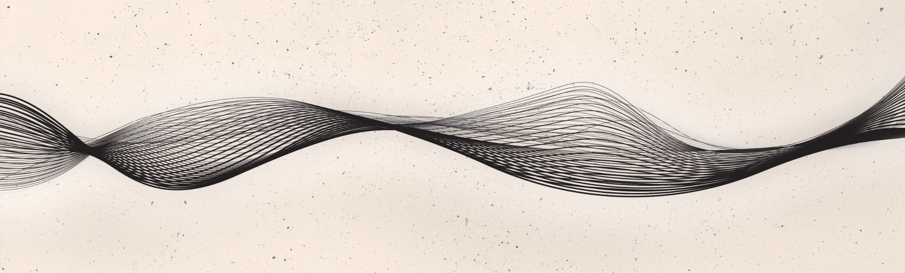

# Challenge 3: Robotic Pipetting Protocol Simulation

### Overview

This project simulates a **liquid-handling robot protocol** for normalizing DNA concentrations across 96 samples in a 96-well plate format.

Each sample is normalized to a target concentration of **20 ng/µL**, respecting lab constraints:
- Total volume ≤ **50 µL**
- Rounding pipette volumes to **0.1 µL**
- Output in a format that can drive automation

The output includes:
- Required volume of sample and water per well
- Optionally, a plot of volume distributions for QA

---

### Input: 96-Well Plate with Variable Concentrations

We use a simple CSV format to represent the input concentrations of DNA in ng/µL:

📄 `sample_concentrations.csv`

```csv
SampleID,Concentration (ng/µL)
Sample01,48.7
Sample02,12.3
...
